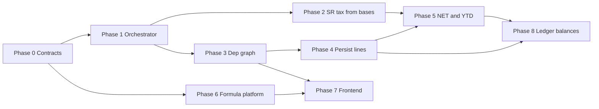

# Payroll engine roadmap — spec → repository

**Status:** Planning (documentation only — no implementation until module specs and acceptance criteria are signed off per phase).  
**Audience:** Product, backend, frontend, compliance.  
**Target architecture:** [Generic Global Payroll Engine](#target-architecture-summary) (NET-driven graph, 4-phase lifecycle, Suriname as first country).  
**Authority order:** `docs/prompts/PROJECT-CONTEXT.md` → this roadmap → per-phase **module docs** → `docs/output/ARCHITECTURE-DEFINITION.md` (regenerate after major phase completion).

---

## Related documentation (existing)

| Document | Role |
|----------|------|
| [`../modules/payroll-wage-component-engine.md`](../modules/payroll-wage-component-engine.md) | DDL, tenant/platform components, formula DSL contract, engine skeleton |
| [`../modules/payroll-calculation-bases.md`](../modules/payroll-calculation-bases.md) | `platform_payroll_base`, `*_base_effect`, accumulator (preview) |
| [`../features/payroll-wage-component-engine-design.md`](../features/payroll-wage-component-engine-design.md) | Long-form product design (phases 1–7, country providers) |
| [`../modules/pay-periods.md`](../modules/pay-periods.md) | Pay periods, runs, materialize inputs, formula preview API |
| [`../modules/employee-periodic-payroll-transactions.md`](../modules/employee-periodic-payroll-transactions.md) | Standing instructions → period transactions |
| [`../modules/payroll-engine-country.md`](../modules/payroll-engine-country.md) | Per-country execution adapters (Phase 0 draft) |
| [`PAYROLL-GOLDEN-SCENARIO-SR.md`](./PAYROLL-GOLDEN-SCENARIO-SR.md) | Demo tenant regression scenario (provisional v0.1) |
| [`../decisions/README.md`](../decisions/README.md) | ADRs PE-001 … PE-003 (Proposed) |
| [`MODULE-INDEX.md`](./MODULE-INDEX.md) | Milestone index |

---

## Current state (repository snapshot)

What is **already shipped** (foundation — do not re-litigate without ADR):

| Capability | Location / notes |
|------------|------------------|
| Wage component + template schema | `platform_wage_component`, `platform_wage_component_template`, `tenant_wage_component` |
| Formula validate + evaluate (restricted DSL) | `WageComponentFormulaValidator`, `WageComponentFormulaEvaluator`, `WageComponentFormulaDsl` |
| Engine entry point | `PayrollEngine` / `DefaultPayrollEngine` |
| Country rule hooks (hints only) | `CountryRuleProvider`, `SurinameCountryRuleProvider`, `SurinameTaxRuleResolutionService` |
| Versioned SR tax parameters (data) | `platform_country_tax_rule.parameters_json` v2, platform admin UI |
| Calculation bases + effects | `platform_payroll_base`, `tenant_wage_component_base_effect`, `PayrollBaseAccumulator` |
| Period formula preview | `POST /api/v1/pay-periods/{id}/formula-preview` → amounts + `employeeBaseTotals` |
| Immutable result line **table** | `tenant_payroll_result_line` (no writer from engine yet) |
| Platform admin UI | Templates (incl. base effects), country tax rules, payroll bases |
| Tenant formula editor (partial) | `WageComponentFormulaEditor` + Monaco + allowlisted refs |

What is **explicitly not** implemented yet (gaps vs target spec):

| Spec element | Gap |
|--------------|-----|
| DAG execution | No component graph; list order (`processing_order`) only |
| NET as root / backward resolution | Not present |
| Topological sort for statutory formulas | Not present |
| MVEL / SpEL / Drools | Custom DSL only |
| 4-phase orchestrated lifecycle | `PayrollPhase` on rows; engine ignores phases |
| Phase 3: apply tax from accumulated bases | Tax JSON resolved to hints only |
| Phase 4: NET equation + YTD accumulators | Preview totals only; no YTD persistence |
| Component dependency join table | Only base-effect dependencies |
| `payroll_run_detail` / per-formula audit persistence | Schema exists; engine does not write |
| `CALCULATE_SURINAME_TAX(...)`-style hooks | Not in evaluator |
| Frontend graph administrator | No visual DAG; base-effects table only |
| Dedicated formula validate API | Preview is pay-period scoped, not `.../components/validate` |

---

## Target architecture summary

Normalized from the product spec (sections 1–5) and aligned with existing design docs where they agree.

### Execution model (target)

```text
[Phase 1: Context]     → variables, rates, tax tables as-of, transactions, compensation
        ↓
[Phase 2: Gross & bases] → evaluate earning/deduction components → amounts → base accumulation
        ↓
[Phase 3: Statutory]   → topological run of statutory/platform components consuming bases
        ↓
[Phase 4: Net & YTD]   → final NET, persist lines + formula breakdown, update accumulators
```

**Graph semantics (target):**

- Each wage component (platform statutory + tenant) is a **node**.
- Edges: explicit **depends-on** (other component codes) and/or **reads base** (`GROSS`, `LOONBELASTING`, …).
- **NET** is the primary outcome node; ordering is derived by **topological sort** (with cycle detection), not UI list sort alone.
- Country law is **data**: formulas in DB + reference tables (`platform_country_tax_rule`, future bracket tables), evaluated by a **rule layer** (DSL extension and/or embedded EL — see Phase 0 ADR).

### Data model (target)

| Concept | Target |
|---------|--------|
| Component formula | `formula_expression` (and/or rule reference) on definition row |
| Dependencies | Join table or JSON array of component codes + validated acyclic graph |
| Subjectivity | `*_base_effect` rows (legacy `taxable_*` retired from engine path) |
| Evaluation context | `PayrollEvaluationContext` → extensible `Map<String, Object>` (typed accessors for v1 refs) |
| Audit | `tenant_payroll_result_line` + optional `formula_trace_json` / child detail table per run |

### Suriname (target test case)

- Progressive wage tax: `platform_country_tax_rule` + engine function or provider step consuming `LOONBELASTING` (or equivalent) base total.
- AOV / SZF / pension: bases + statutory components with employer/employee `impact_side` and split parameters in rule JSON.
- No Suriname-specific branches in `DefaultPayrollEngine` — only `SurinameCountryRuleProvider` (or successor).

### Frontend (target)

- **Formula builder:** token/chip UI mapped to allowlisted variables (existing Monaco path may remain for power users).
- **Dependency mapper:** structural UI for component deps + base effects (graph or ordered list with validation).
- **Live validate:** stateless `POST .../validate` (or preview) with mock context before save.
- **Graph admin:** read-only dependency view → later editable graph for platform operators.

---

## Implementation principles (all phases)

1. **Module doc before code** — each phase updates or creates the sole schema authority (`SCHEMA-PERSISTENCE-PREFLIGHT.md`).
2. **No silent schema drift** — proposed columns go under `## Proposed Schema Extension` until approved.
3. **Suriname-first, country-agnostic core** — SR behavior only via providers + seed data + tests.
4. **Backward compatibility** — legacy `taxable_*` / `net_effect` remain until Phase 2 engine cutover + migration verification.
5. **Acceptance = tests + module AC table** — IT for engine, contract tests for APIs, one SR golden employee scenario by Phase 3 complete.

---

## Phase overview

| Phase | Name | Outcome | Depends on |
|-------|------|---------|------------|
| **0** | Contracts & ADRs | Decisions documented; `payroll-engine-country.md` drafted | — |
| **1** | Four-phase orchestrator | Explicit phase pipeline in engine (stubs OK for 3–4) | 0 |
| **2** | Bases → statutory (SR tax) | Phase 3 computes SR wage tax from accumulated bases | 1, calculation-bases |
| **3** | Component dependency graph | DDL + topological execution + cycle detection | 1 |
| **4** | Persist run & audit trail | `tenant_payroll_result_line` (+ detail) written on finalize/preview flag | 1–3 |
| **5** | NET closure & YTD | Final NET equation + year-to-date accumulators | 2, 4 |
| **6** | Formula platform & validate API | EL/DSL decision implemented; component validate endpoint | 0, 1 |
| **7** | Frontend graph & builder | Dependency mapper, validate UX, operator graph view | 3, 6 |
| **8** | Ledger & balances | Design doc phases 6–7 (posting, loan/reserve balances) | 4, 5 |

Phases **2** and **3** can be parallelized after **1** if staffing allows; **4** should follow first successful end-to-end tax line. **7** can start UI mocks after **0**.



---

## Phase 0 — Contracts & architecture decisions

**Goal:** Lock documentation and ADRs so implementation does not fork.

### Deliverables

| Item | Status | Link |
|------|--------|------|
| **ADR: Execution model** | Draft (Proposed) | [`ADR-PE-001`](../decisions/ADR-PE-001-payroll-execution-model.md) |
| **ADR: Expression runtime** | Draft (Proposed) | [`ADR-PE-002`](../decisions/ADR-PE-002-formula-expression-runtime.md) |
| **ADR: `processing_order` vs graph** | Draft (Proposed) | [`ADR-PE-003`](../decisions/ADR-PE-003-processing-order-vs-graph.md) |
| **`payroll-engine-country.md`** | Draft | [`../modules/payroll-engine-country.md`](../modules/payroll-engine-country.md) |
| **Golden scenario (SR)** | Provisional v0.1 | [`PAYROLL-GOLDEN-SCENARIO-SR.md`](./PAYROLL-GOLDEN-SCENARIO-SR.md) |
| **Update** wage-component-engine §7 | Done | Phased pipeline link added |
| **Update** calculation-bases §7 | Done | Roadmap + SR consumption pointer |
| **Regenerate** `ARCHITECTURE-DEFINITION.md` | Pending | After ADRs **Accepted** |

### Acceptance criteria (Phase 0 exit)

- [ ] ADR-PE-001, 002, 003 reviewed → status **Accepted** (or comments recorded).
- [x] `payroll-engine-country.md` exists; Phase 0 states **no new tables**.
- [x] Golden SR scenario exists, marked **provisional** until SME sign-off (§ Sign-off checklist).
- [x] Annualization policy for `freq: YEAR` rules decided and reflected in golden doc § Phase 2 (Policy A).

### Out of scope

- Application code changes.

---

## Phase 1 — Four-phase orchestrator

**Status:** **Implemented** (see [`PAYROLL-ENGINE-PHASE-1.md`](./PAYROLL-ENGINE-PHASE-1.md))

**Goal:** `DefaultPayrollEngine` delegates to `PayrollRunOrchestrator` with an explicit **4-phase pipeline**; preview behavior unchanged; phases 3–4 macro steps are stubs until Phases 2/4/5/8.

### Backend

| Task | Detail |
|------|--------|
| Introduce `PayrollRunPhase` enum | `CONTEXT`, `GROSS_AND_BASES`, `STATUTORY`, `NET_AND_ACCUMULATORS` mapped to spec §2 |
| Refactor `calculate()` | Delegate to phase handlers; each phase receives mutable `PayrollRunState` |
| Expand evaluation context | `PayrollRunState` holds `FormulaEvaluationContext` + `Map<String, Object> variables` + country hints |
| Phase 1 implementation | Load company, period, employees, transactions, compensation, resolve `countryRulesAsOf` |
| Phase 2 implementation | Move current component evaluation + `PayrollBaseAccumulator` here |
| Phase 3–4 stubs | No-op or pass-through with structured logging / debug DTO |

### Data

- No mandatory new tables; optional `payroll_run_phase_log` deferred to Phase 4.

### Tests

- `DefaultPayrollEngineIT`: preview output unchanged vs baseline (regression).
- Unit tests: phase order invoked once per `calculate()`.

### Module doc updates

- [x] `payroll-wage-component-engine.md` §7 — phase diagram and AC-PE1-*.
- [x] **[`PAYROLL-ENGINE-PHASE-1.md`](./PAYROLL-ENGINE-PHASE-1.md)** — full implementation spec (`PayrollRunState`, handlers, tests).

### Acceptance criteria

See [`PAYROLL-ENGINE-PHASE-1.md`](./PAYROLL-ENGINE-PHASE-1.md) §8 (AC-PE1-1 … AC-PE1-5).

### Implementation gate

- [ ] Complete [`../decisions/ADR-REVIEW-CHECKLIST.md`](../decisions/ADR-REVIEW-CHECKLIST.md) before first Phase 1 PR.

---

## Phase 2 — Statutory calculation from bases (Suriname wage tax)

**Status:** **Implemented** (see [`PAYROLL-ENGINE-PHASE-2.md`](./PAYROLL-ENGINE-PHASE-2.md))

**Goal:** Phase 3 **computes** SR inkomstenbelasting (and AOV employee premium) from accumulated bases using seeded `platform_country_tax_rule` — not hints only.

**Implementation spec:** [`PAYROLL-ENGINE-PHASE-2.md`](./PAYROLL-ENGINE-PHASE-2.md)

### Backend

| Task | Detail |
|------|--------|
| `SurinameWageTaxCalculator` (or provider method) | Parse `MARGINAL_RATES` / `FLAT_RATE` from resolved rule JSON |
| Input | Employee `LOONBELASTING` (and/or `GROSS`) from Phase 2 `employeeBaseTotals` |
| Output | `EvaluatedComponentAmount` for statutory platform component(s) e.g. wage tax slot |
| Wire into Phase 3 | After bases computed, run statutory platform components for country |
| Base effect types | Implement `PERCENTAGE` in `PayrollBaseAccumulator` if needed for SR premiums |
| Employer splits | Read employer/employee share from rule JSON or component `impact_side` |

### Data

- Confirm statutory component codes in seed align with calculator outputs.
- Optional: `tenant_payroll_ytd_balance` — defer full design to Phase 5.

### Tests

- IT: golden SR scenario wage tax within tolerance.
- IT: rule version selection by `countryRulesAsOf` (pay-period end).

### Module doc updates

- `payroll-engine-country.md` — SR tax algorithm, parameters_json contract.
- `payroll-calculation-bases.md` — which bases feed which rules.

### Acceptance criteria

- [ ] AC-PE2-1: Preview returns non-zero wage tax line for demo SR employee when bases > 0.
- [ ] AC-PE2-2: Changing tax rule effective date changes result (versioning).
- [ ] AC-PE2-3: Calculator has no hardcoded bracket constants outside test fixtures.

---

## Phase 3 — Component dependency graph

**Status:** **Implemented** (see [`PAYROLL-ENGINE-PHASE-3.md`](./PAYROLL-ENGINE-PHASE-3.md))

**Goal:** Explicit **depends-on** between components; engine runs tenant components in **topological order**; cycle detection on save; DSL `component("CODE").amount`.

**Specs:** [`PAYROLL-ENGINE-PHASE-3.md`](./PAYROLL-ENGINE-PHASE-3.md), module [`../modules/payroll-component-dependencies.md`](../modules/payroll-component-dependencies.md)

### Data model

Template + tenant dependency join tables (ADR-PE-003). Schema authority in module doc.

### Backend

| Task | Detail |
|------|--------|
| Graph builder | Build DAG from dependencies + statutory edges |
| Topological sort | Kahn’s algorithm; stable tie-break by `processing_order` |
| Cross-component formulas | Extend DSL refs: `@component:CODE` or `component.1001.amount` (ADR) |
| Validators | Cycle detection on template/component save |
| Phase 2 ordering | Evaluate tenant components in topo order; re-accumulate bases if deps require |

### Frontend (minimal)

- Platform template edit: “Depends on” multi-select (codes).
- Show validation error on cycle.

### Tests

- Unit: cycle detection rejects A→B→A.
- IT: component B formula referencing A amount runs after A.

### Acceptance criteria

- [ ] AC-PE3-1: Engine rejects cyclic graph at run time with clear error code.
- [ ] AC-PE3-2: Admin cannot save cyclic template dependencies.
- [ ] AC-PE3-3: Topo order differs from list sort when deps demand it (test fixture).

---

## Phase 4 — Persist payroll run & audit trail

**Status:** Shipped (2026-05-18)

**Goal:** Immutable **per-employee, per-component, per-run** lines with enough detail to audit formula results after rule changes.

**Spec:** [`PAYROLL-ENGINE-PHASE-4.md`](./PAYROLL-ENGINE-PHASE-4.md)

### Data model

| Item | Detail |
|------|--------|
| `tenant_payroll_result_line` | Wire existing columns: amounts, `component_source`, `component_ref_id`, `pay_period_run_id` |
| Optional extension | `evaluated_formula_json`, `input_variables_json`, `base_snapshot_json` — module doc allowed list |

### Backend

| Task | Detail |
|------|--------|
| `PayrollResultPersistenceService` | Write lines on **finalize run** (and optional `?persist=true` on preview for admins) |
| Link to pay period run | Status transition on `tenant_pay_period_run` |
| Audit events | `TENANT_PAYROLL_RUN_FINALIZED`, line counts in metadata |

### API

- Extend pay period **generate/finalize** flow (see `pay-periods.md`) to call engine + persist.

### Tests

- IT: finalize creates N lines per employee × active components.
- IT: re-finalize blocked or creates new run version (ADR).

### Acceptance criteria

- [x] AC-PE4-1: Finalized run lines queryable by employee + period.
- [x] AC-PE4-2: Stored line includes amount matching preview at finalize time.
- [ ] AC-PE4-3: Historical lines unchanged when platform tax rule updated later (manual / future IT).

---

## Phase 5 — NET closure & year-to-date accumulators

**Status:** Shipped (2026-05-18)

**Goal:** Phase 4 computes **NET** via explicit equation; YTD totals updated for compliance reporting.

**Spec:** [`PAYROLL-ENGINE-PHASE-5.md`](./PAYROLL-ENGINE-PHASE-5.md)

### Backend

| Task | Detail |
|------|--------|
| NET aggregation | Sum bases/effects per spec: Gross + allowances − deductions − taxes − premiums (ADR exact mapping) |
| YTD table | e.g. `tenant_payroll_ytd_accumulator` (`tenant_id`, `employee_id`, `base_code`, `tax_year`, `amount`) |
| Phase 4 handler | Update YTD after lines persisted |

### Tests

- Golden scenario: NET matches spreadsheet.
- YTD increments across two periods in same tax year.

### Acceptance criteria

- [ ] AC-PE5-1: `employeeBaseTotals.NET` (or dedicated field) matches payslip NET on golden case.
- [ ] AC-PE5-2: YTD query API returns correct cumulative wage tax base.

---

## Phase 6 — Formula platform & validate API

**Status:** Shipped (2026-05-18)

**Goal:** Align expression runtime with Phase 0 ADR; expose **stateless validate/preview** for a single component definition.

### Backend

| Task | Detail |
|------|--------|
| Implement ADR choice | SpEL/MVEL sandbox **or** DSL v2 with country functions |
| Country functions | e.g. `surinameWageTax(base)` delegating to Phase 2 calculator |
| `POST /api/v1/tenant/wage-components/validate-formula` | Body: method, expression, mock context → amount or errors |
| `POST /api/v1/platform/wage-component-templates/validate-formula` | Platform superadmin |

### Security

- No arbitrary classpath access; timeout; expression length limits.

### Acceptance criteria

- [x] AC-PE6-1: Validate returns Problem+JSON on syntax/unknown ref.
- [x] AC-PE6-2: Same expression evaluates identically in validate and engine run.

---

## Phase 7 — Frontend graph administrator & builder

**Goal:** Next.js supports **dependency mapping**, **formula tokens**, and **live validate** per spec §5.

### Web

| Task | Detail |
|------|--------|
| Template/component edit | Dependency multi-select + read-only graph (mermaid or simple DAG SVG) |
| Formula editor | Chip/token bar for allowlisted refs; optional Monaco toggle |
| Validate panel | Call Phase 6 API with mock hours/salary |
| Pay period preview | Show base totals + statutory lines (extend existing preview UI) |
| i18n | Keys under `platformWageComponentTemplates.*` / `wageComponents.*` |

### Acceptance criteria

- [x] AC-PE7-1: Operator sees cycle error before save.
- [x] AC-PE7-2: Validate shows computed amount without full pay period.
- [x] AC-PE7-3: Graph view lists dependencies for template code 1001 (smoke).

---

## Phase 8 — Ledger posting & balance tracking

**Goal:** Accounting postings and loan/reserve balance updates after finalize.

**Specs:** [`PAYROLL-ENGINE-PHASE-8.md`](./PAYROLL-ENGINE-PHASE-8.md), module [`../modules/payroll-ledger-posting.md`](../modules/payroll-ledger-posting.md)

### Acceptance criteria

See Phase 8 spec (AC-PE8-*, AC-PLP-*). Shipped: loan template `1003` balance decreases on repayment; ledger postings for demo `1001`.

---

## Phases 6–7 — Formula validate & frontend

**Spec:** [`PAYROLL-ENGINE-PHASE-6-7.md`](./PAYROLL-ENGINE-PHASE-6-7.md) (shipped)

---

## Cross-phase: deprecate legacy flags

| Milestone | Action |
|-----------|--------|
| After Phase 2 engine cutover | Stop reading `taxable_*` / `net_effect` in engine; bases only |
| After Phase 7 UI | Remove flags from template JSON editor defaults; migration cleanup optional |
| Liquibase | New migration only after module doc update; never drop columns without ADR |

---

## API surface (consolidated target)

| Method | Path | Phase |
|--------|------|-------|
| POST | `/api/v1/pay-periods/{id}/formula-preview` | Exists (extend payload in 2, 4, 5) |
| POST | `/api/v1/pay-periods/{id}/finalize` (or run action) | 4 |
| POST | `/api/v1/tenant/wage-components/validate-formula` | 6 |
| POST | `/api/v1/platform/wage-component-templates/validate-formula` | 6 |
| GET | `/api/v1/employees/{id}/payroll-ytd` | 5 |

---

## Testing strategy

| Layer | Approach |
|-------|----------|
| Unit | Topo sort, tax calculator, DSL/SpEL sandbox, base accumulator |
| Integration | `DefaultPayrollEngineIT` + SR golden scenario per phase |
| Contract | REST preview/finalize/validate Problem+JSON |
| Frontend | Playwright smoke: template deps save, validate panel |

---

## Suggested delivery order (teams)

1. **Backend platform:** Phase 0 → 1 → 2 → 3 → 4 → 5 → 6.  
2. **Frontend:** Phase 7 after 0 (mockups) and 6 (API); parallel base-effects polish already done.  
3. **Compliance / product:** Golden scenario + ADR review in Phase 0; sign-off each phase AC table.

**Estimated sequencing (calendar agnostic):** 0 (1–2 wks) → 1 (1–2 wks) → 2+3 parallel (2–4 wks) → 4 (1–2 wks) → 5 (1–2 wks) → 6 (2 wks) → 7 (2–3 wks) → 8 (TBD).

---

## Checklist before starting implementation (any phase)

- [ ] Phase module doc updated with **allowed columns** and acceptance criteria IDs (`AC-PEX-N`).
- [ ] Schema preflight completed (`SCHEMA-PERSISTENCE-PREFLIGHT.md`).
- [ ] Privileges and audit action codes listed if new APIs.
- [ ] This roadmap phase marked **In progress** in `MODULE-INDEX.md` notes.
- [ ] Golden SR scenario extended if phase touches tax/NET.

---

## Document history

| Date | Change |
|------|--------|
| 2026-05-17 | Initial roadmap from spec gap analysis vs repository snapshot |
| 2026-05-17 | Phase 0 drafts: ADRs PE-001–003, `payroll-engine-country.md`, golden scenario SR v0.1 |
| 2026-05-17 | Phase 1 implementation spec + ADR review checklist; wage-component-engine §7 expanded |
| 2026-05-17 | Phases 2–7 specs; `payroll-component-dependencies` module; docs index |
