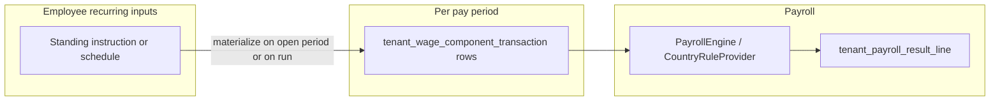

# Agent guide: employee periodic payroll transactions

This document tells **planning agents** and **implementation agents** how to specify and build the feature for **managing periodic (recurring) payroll inputs per employee** in this repository, in a **Suriname-aware** way, without duplicating full tax law in product code.

---

## 1. Audience and order of work

| Role | Primary prompt / doc | Responsibility |
|------|----------------------|----------------|
| Feature planning | [`FEATURE-PLANNING-AGENT-PROMPT.md`](./FEATURE-PLANNING-AGENT-PROMPT.md) | Intake, structured spec, no code; mandatory template sections |
| Implementation | [`MASTER-FEATURE-END-TO-END.md`](./MASTER-FEATURE-END-TO-END.md) | Backend + web + mobile per **one** module doc |

**Recommended sequence**

1. Read this guide and the existing engine module: [`../modules/payroll-wage-component-engine.md`](../modules/payroll-wage-component-engine.md).
2. Produce or update the **sole feature contract**: [`../modules/employee-periodic-payroll-transactions.md`](../modules/employee-periodic-payroll-transactions.md) (follow FEATURE-PLANNING sections; see §6 checklist below).
3. For any **new tables, columns, entities, or Liquibase**: read [`../guides/SCHEMA-PERSISTENCE-PREFLIGHT.md`](../guides/SCHEMA-PERSISTENCE-PREFLIGHT.md) and [`../guides/DATA-MODEL-STANDARDS.md`](../guides/DATA-MODEL-STANDARDS.md). **No module spec = no implementation** (preflight §0).

---

## 2. Glossary (product language)

| Term | Meaning in this codebase |
|------|---------------------------|
| **Wage component definition** | `tenant_wage_component` — tenant-scoped configuration (earnings, deductions, etc.), often created from platform templates. |
| **Period transaction** | `tenant_wage_component_transaction` — **input row for a specific pay period** (employee + `pay_period_id` + component + amounts). This is what [`DefaultPayrollEngine`](../modules/payroll-wage-component-engine.md) should consume for variable inputs. |
| **Recurring / standing instruction** | Product concept: “pay this every month until …” or “deduct loan installment X per period.” May require a **new** persistence concept (see §4). |
| **Payroll result line** | `tenant_payroll_result_line` — **immutable output** of a run; not the same as input transactions. |
| **Tax parameters** | `platform_country_tax_rule` — versioned, country-owned JSON consumed by `CountryRuleProvider` (e.g. Suriname brackets); not employee-level. |

Do **not** use “transaction” in docs to mean both **ledger postings** and **wage component inputs** without disambiguation.

---

## 3. Suriname payroll lens (concise)

Use this as **domain context** when writing acceptance criteria and data needs. **Do not** paste entire rate tables into the module doc; reference **effective-dated** platform rules and official sources for production.

**Primary lay summary (verify against statute / advisor):** [FiscLe — Wage Tax (Suriname)](https://fiscleconsultancy.com/2025/07/23/wage-tax/)

**Themes the product must respect over time**

- **Broad definition of wages**; many items are **excluded**, **capped**, or **valued** specifically (child allowances, holiday/bonus caps by **calendar year**, pension-related amounts, exchange-rate compensation caps, anniversary exemptions, benefits in kind such as company car / housing / meals, etc.).
- **Different withholding treatments** for **normal monthly wages**, **lump-sum benefits**, and **overtime**, with **effective dates** (e.g. overtime bracket changes **2025-07-01** per the summary). Some lump-sum regimes require **Inspector approval** — treat as **configuration + evidence / workflow** in the spec, not as silently automatic.
- **Deductible costs** (e.g. 4% of wages with an annual cap; cap stepped up from 2024 in the summary) affect how **taxable net wage** is framed. Decide in the module doc whether v1 stores this on the **employee**, derives it in the **engine only**, or attaches it to **inputs**.
- **Employer obligations** (e.g. filing/payment timing) may be **out of scope** for v1; if so, state explicitly under Scope / non-goals.

**Employee master data gap (today):** [`payroll-org-structure.md`](../modules/payroll-org-structure.md) defines `tenant_employee` without dependents, tax credits, or inspector approvals. Periodic payroll features may **depend on new employee fields** or **separate entities** — call that out in **Open Questions** and **Data Model**.

---

## 4. Core conceptual fork (planners must resolve)

Recurring inputs relate to **period-scoped** rows already in the schema. The feature spec **must choose one** primary model and document trade-offs in **§ Data model** and **§ Business rules**.

| Option | Idea | Pros | Cons |
|--------|------|------|------|
| **A** (default to document) | New **employee-level standing instruction** (effective dates, recurrence, link to `tenant_wage_component`, amount or quantity/rate). **Materialize** into `tenant_wage_component_transaction` when a period opens or when a run is prepared. | Clear separation of “policy” vs “this month’s input”; aligns with existing period transaction table. | Requires materialization rules, idempotency, and conflict handling with manual rows. |
| **B** | Add recurrence fields on **`tenant_wage_component_transaction`** | Single table | Awkward: table is keyed by **`pay_period_id`**; recurrence does not belong on one period’s row. |
| **C** | No standing table — only APIs/UI to **bulk-create** period transactions | Simplest schema | Weak “periodic” story; more user effort each month. |

**Implementation handoff:** The module doc must state whether **v1 engine** reads **only** materialized `tenant_wage_component_transaction` rows or may read **standing instructions** directly (second path adds coupling and ordering rules).

---

## 5. What “periodic” should cover for Suriname v1 (examples)

These are **illustrative** product capabilities; the module doc narrows or defers them.

- Fixed **monthly** earning or deduction (allowance, fixed premium).
- **Loan repayment** installment linked to a balance (future: [`tenant_wage_component_balance`](../modules/payroll-wage-component-engine.md)); v1 might still store a fixed amount per period via standing instruction.
- Inputs that **feed tax classification** (e.g. overtime totals from [`work-times.md`](../modules/work-times.md) vs manual overtime amount) — specify **single source of truth** to avoid double counting.
- Data needed for **exemptions/caps** (e.g. number of qualifying children, anniversary year) if not on the employee record — either extend org module (**PII review**) or attach to standing instruction / period lines.

---

## 6. Cross-cutting rules

- **Tenancy and company boundary:** All tenant data scoped by `tenant_id`; payroll inputs by **`company_id`** consistent with [`payroll-org-structure.md`](../modules/payroll-org-structure.md).
- **Privileges:** Align with existing `WAGE_COMPONENT_VIEW` / `WAGE_COMPONENT_MANAGE` or introduce explicit names (e.g. `EMPLOYEE_PAYROLL_INPUT_VIEW` / `MANAGE`); module doc is authoritative.
- **Audit:** [`payroll-wage-component-engine.md`](../modules/payroll-wage-component-engine.md) already lists `TENANT_WAGE_COMPONENT_TRANSACTION` for future mutating APIs; extend `AuditResourceTypes` / action codes when adding standing instructions or new endpoints.
- **Ledgers:** Result lines and future posting writers consume **outputs**; periodic **inputs** should map to definitions that declare ledger metadata where applicable (see engine design doc).

---

## 7. Planning checklist → FEATURE-PLANNING template

When drafting [`../modules/employee-periodic-payroll-transactions.md`](../modules/employee-periodic-payroll-transactions.md), ensure each section answers the following.

| Template section | Questions the spec must answer |
|------------------|--------------------------------|
| **1. Objective** | What problem for payroll operators? How does this reduce manual re-entry each period? |
| **2. Scope** | In/out: materialization, work-time integration, platform vs tenant components, historical edits. |
| **3. Actors** | Who can create standing instructions vs period adjustments vs view-only? |
| **4. User flows** | Create/edit/end standing instruction; materialize for period; override with `manual_override` on period row; run payroll; recalculation (if any). |
| **5. Data model** | Option A/B/C; entities; FKs to `employee`, `company`, `tenant_wage_component`, `pay_period`; optional `pay_period_run_id` semantics on transactions. |
| **6. States & transitions** | Draft vs active standing instruction; cancelled; period transaction lifecycle vs finalized run (if locked). |
| **7. Business rules** | Effective dating; overlap of two standing instructions for same component; proration for mid-period hires; currency (company currency only?). |
| **8. Edge cases** | Backdated changes; deleted employee; component deactivated; concurrent runs; duplicate materialization. |
| **9. UX** | List/filter by employee and period; warnings when caps may apply (informational). |
| **10. Open questions** | Inspector approval storage; dependents on employee vs elsewhere; overtime source. |
| **11. Acceptance criteria** | Testable API/UI rules; engine integration level for v1. |

---

## 8. Handoff to MASTER-FEATURE

1. Attach exactly **one** module path: `@docs/modules/employee-periodic-payroll-transactions.md`.
2. Attach `@docs/prompts/PROJECT-CONTEXT.md`, `@docs/prompts/MASTER-FEATURE-END-TO-END.md`, `@docs`, repo root; for persistence changes add preflight + data model guides.
3. Acceptance criteria should map to **automated tests** (e.g. API integration tests) like other tenant features.
4. After implementation, update the module doc with **API notes** and pointers per [`MODULE-DOC-CONVENTION.md`](../guides/MODULE-DOC-CONVENTION.md).

---

## 9. Explicit non-goals (unless the human expands scope)

- Replacing the full **wage tax engine** or encoding every historical bracket in v1 UI.
- Full **Inspector approval** workflow and document vault.
- **Multi-employer** annual income tax reconciliation for employees with multiple jobs.
- **Legal filing** automation and calendar (may be a later milestone).

---

## 10. Related documents

- [`../modules/payroll-wage-component-engine.md`](../modules/payroll-wage-component-engine.md) — existing transaction + engine contract.
- [`../features/payroll-wage-component-engine-design.md`](../features/payroll-wage-component-engine-design.md) — long-form engine narrative.
- [`../modules/payroll-org-structure.md`](../modules/payroll-org-structure.md) — employee and company boundaries.
